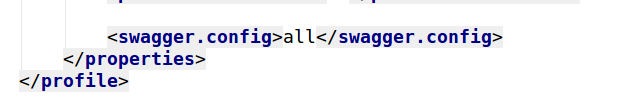

swagger2_document
-----------------------
基于swagger2的工具包，在spring项目中引入该工具包即可自动生成相应的接口文档

## 环境依赖：
### Spring版本：4.3.3（需要项目使用4.3.3版本及以上的spring才确保正常使用）
### Swagger2版本：2.6.1
### Jackson版本：2.6.0  

	
##### 现在本地install项目之后，引入依赖：
<pre><code>
　　<dependency>
			<groupId>com.idohoo.tool</groupId>
			<artifactId>swagger2_document</artifactId>
			<version>1.0-SNAPSHOT</version>
		</dependency>
</code></pre>
##### 在项目中引入swagger2_document的配置文件：
``<import resource="classpath*:swagger2-config-${profile}.xml" />``
##### ${profile}占位符可以填写all或者none，all标识正常配置，none标识不配置,通过此标识可以区分开发环境和生产环境

### 配置文件：
* Spring配置xml中：
  
* pom.xml的profiles配置中：
  	

### 实现一个接口*提供相关的接口文档初始化信息：
接口：``com.idohoo.util.config.SwaggerInfoConfig``  
将实现类定义加上``@Service``注解，归入springBeanFactory管理  
完成上述操作之后便可在Controller使用``@Api``，``@ApiOperation``等注解声明文档;

#### 附加：
[swagger2常用注解说明](https://blog.csdn.net/u014231523/article/details/76522486)  
[Spring4集成Swagger：真的只需要四步，五分钟速成](https://blog.csdn.net/blackmambaprogrammer/article/details/72354007)  
